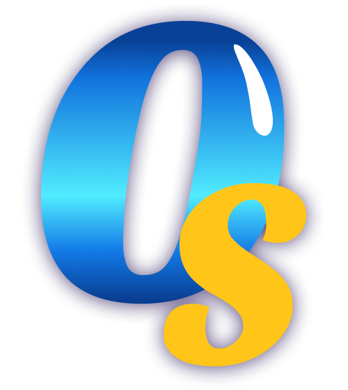

# 

## Eng

<h1><a href="https://play.google.com/store/apps/details?id=com.cookapps.playgrounds.ff.oceanblast&hl=uk" target="_blank" rel="noopener noreferrer">Ocean Splash</a></h1>
Dive into the cozy marine world of Ocean Splash and discover the best new free
match-3 puzzle game!

Deep under the ocean waters lies a dreamland with sparkling shells, cute
starfish, sweet jellyfish, and other sea creatures waiting for you to touch,
swap, and explode them around! Play fun and clever match-3 puzzle games across
hundreds of underwater levels! Enjoy dynamic obstacles and brilliant puzzles
created just for your enjoyment! Ocean Splash: Jelly Fish is cute yet smart, and
all you need to do is relax and have fun! In this delightful game, you can swap,
tap, and match without distractions. After all, the most important person in
this ocean world is YOU.

## Ua

<h1><a href="https://play.google.com/store/apps/details?id=com.cookapps.playgrounds.ff.oceanblast&hl=uk" target="_blank" rel="noopener noreferrer">Ocean Splash</a></h1>
Пориньте в затишний морський світ Ocean Splash і відкрийте для себе найкращу нову безкоштовну гру-головоломку 3 в ряд !

Глибоко під океанською водою лежить країна мрій із блискучими черепашками,
милими рибками-зірками, солодкими медузами та іншими морськими мешканцями, які
чекають на вас, щоб торкнутися, поміняти місцями та вибухнути навколо! Грайте у
веселі та розумні ігри-головоломки «Збери 3» на сотнях підводних рівнів!
Насолоджуйтесь динамічними перешкодами та блискучими головоломками, створеними
лише для вашого задоволення! Ocean Splash: Jelly Fish мила, але розумна, і все,
що вам потрібно зробити, це розслабитися та отримувати задоволення! У цій
чудовій грі ви можете міняти місцями, натискати та збігати, не відволікаючись.
Зрештою, найважливіша людина в цьому світі океану — це ТИ.

## Made according to design

[Figma](https://www.figma.com/design/pFfdKMW9NOFtvgmVND3Ey8/OcaenSplash_project-for-EvoPlay?node-id=141-1260&t=v79jQM2SyinD8Qzz-1)

## Technologies

 <ul align="left">
  <li> </li>
    <li> </li>
      <li></li> </ul>

## JS libraries

<a href="https://www.npmjs.com/package/swiper" target="_blank" rel="noreferrer">
Swiper </a>

## Installation and Running

1. Clone the repository: git clone
   https://github.com/yourusername/ocean-splash.git
2. Navigate to the project directory: cd easy-campervan
3. Install dependencies: npm install
4. Start the development server: npm start

## Contributing

Contributions are welcome! Please follow these steps:

1. Fork the repository.
2. Create a new branch (`git checkout -b feature-branch`).
3. Commit your changes (`git commit -m 'Add some feature'`).
4. Push to the branch (`git push origin feature-branch`).
5. Create a new Pull Request.
